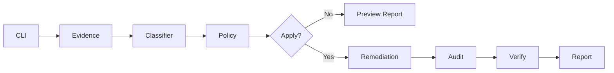

# Architecture

NV-Failsafe Recovery is a small reliability platform for Windows display fallback incidents. The control flow is intentionally linear and auditable:

```text
CLI → Evidence → Classifier → Policy → Remediation → Audit → Report
```

## Components (Python v2.0.0)

| Module | Responsibility |
|--------|----------------|
| `nv_failsafe_recovery/cli.py` | Argument parsing and Windows guard |
| `nv_failsafe_recovery/orchestrator.py` | Mode routing and session audit |
| `nv_failsafe_recovery/evidence.py` | WMI probes + admin check |
| `nv_failsafe_recovery/classifier.py` | Evidence-based suspicion scoring + explanations |
| `nv_failsafe_recovery/policy.py` | Action authorization gates + manual-only escalation |
| `nv_failsafe_recovery/remediation.py` | Preview/apply remediation actions |
| `nv_failsafe_recovery/audit.py` | Append-only JSONL audit trail |
| `nv_failsafe_recovery/reporting.py` | Structured report (v1.1.0) + human summary |

PowerShell v1.1.0 sources are archived under `legacy/powershell/` with the same module names.

Report schema **1.1.0** adds a top-level `report` object separating evidence, hypothesis (`explanation`), preview actions, applied actions, and verification.

## Modes

- **detect** — collect and summarize only
- **report** — detect + write JSON artifact
- **doctor** — explain likely cause and recommended steps
- **fix** — policy-gated remediation (preview by default)
- **verify** — compare before/after reports

## Design principles

1. **Evidence before action** — every recommendation maps to collected probes.
2. **Preview-first** — Fix mode without `--apply` never mutates system state.
3. **Policy gates** — risky operations require explicit flags and admin where appropriate.
4. **Graceful degradation** — probe failures do not abort the entire run.
5. **Stable JSON** — reports are suitable for diffing, scheduling, and incident records.

## PnP remediation note

Monitor refresh and NVIDIA adapter restart use a **documented PowerShell PnP cmdlet shim** (`Disable-PnpDevice` / `Enable-PnpDevice`) invoked via `subprocess` when native Python SetupAPI bindings are not used. This preserves parity with the PowerShell implementation while keeping policy and audit logic in Python.

## Data flow



## Extension points

- Add probes in `evidence.py` with `status` / `source` / `errorMessage` contract.
- Add classification tags in `classifier.py` with evidence strings.
- Add actions in `policy.py` catalog with explicit risk metadata.
- Register remediation handlers in `remediation.py` with audit hooks.
