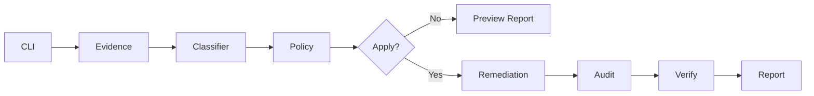

# Architecture

NV-Failsafe Recovery is a small reliability platform for Windows display fallback incidents. The control flow is intentionally linear and auditable:

```text
CLI → Evidence → Classifier → Policy → Remediation → Audit → Report
```

## Components

| Module | Responsibility |
|--------|----------------|
| `scripts/NvFailsafeRecovery.ps1` | CLI orchestration and mode routing |
| `src/Evidence.ps1` | Local probe collection (CIM/PnP) |
| `src/Classifier.ps1` | Evidence-based suspicion scoring + explanations |
| `src/Policy.ps1` | Action authorization gates + manual-only escalation |
| `src/Remediation.ps1` | Preview/apply remediation actions |
| `src/Audit.ps1` | Append-only JSONL audit trail |
| `src/Reporting.ps1` | Structured report (v1.1.0) + human summary |

Report schema **1.1.0** adds a top-level `report` object separating evidence, hypothesis (`explanation`), preview actions, applied actions, and verification.

## Modes

- **Detect** — collect and summarize only
- **Report** — Detect + write JSON artifact
- **Doctor** — explain likely cause and recommended steps
- **Fix** — policy-gated remediation (preview by default)
- **Verify** — compare before/after reports

## Design principles

1. **Evidence before action** — every recommendation maps to collected probes.
2. **Preview-first** — Fix mode without `-Apply` never mutates system state.
3. **Policy gates** — risky operations require explicit flags and admin where appropriate.
4. **Graceful degradation** — probe failures do not abort the entire run.
5. **Stable JSON** — reports are suitable for diffing, scheduling, and incident records.

## Data flow



## Extension points

- Add probes in `Evidence.ps1` with `status/source/errorMessage` contract.
- Add classification tags in `Classifier.ps1` with evidence strings.
- Add actions in `Policy.ps1` catalog with explicit risk metadata.
- Register remediation handlers in `Remediation.ps1` with audit hooks.
